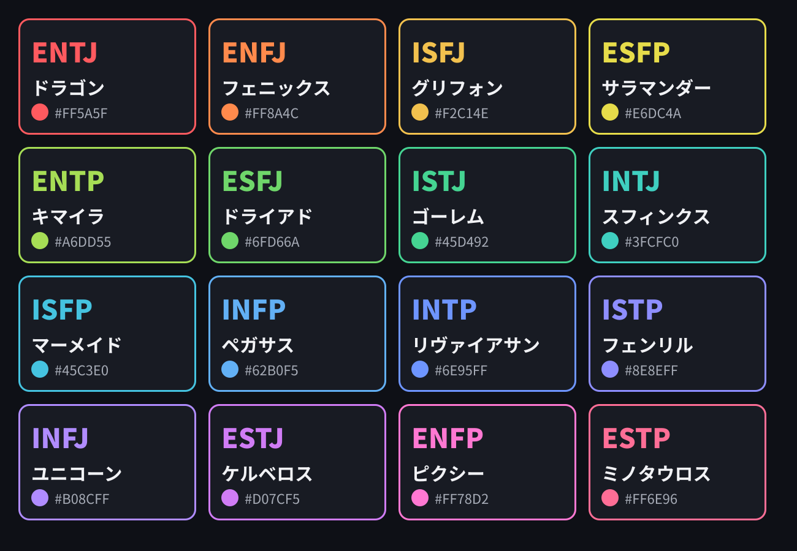

# タイプ色の案

想定読者：タイプ色を決める運営者
作成日：2026-09-15　状態：**運営者のレビュー待ち**（仕様書ステップ 2-3）
元にした決定：`docs/decisions.md` Q20（色は新しく作る。幻獣ごとに1色。背景は暗色で統一）

見本画像は、生成画像用のフォントのサブセット（`assets/fonts/`）で描いた。値は `lib/type-base.ts` と `lib/theme.ts` にある。

## 決め方

16色を色相環にほぼ均等に散らし、呼称のモチーフに近い色を割り当てた。16Personalities は NT を紫、NF を緑、SJ を青、SP を黄で塗り分けている。これを再現しないよう、同じグループの4色は色相環の広い範囲に散らしている。

| TYPE | 呼称 | 色 | モチーフ | 背景とのコントラスト比 |
|---|---|---|---|---|
| ENTJ | ドラゴン | `#FF5A5F` | 赤 | 6.23 |
| ENFJ | フェニックス | `#FF8A4C` | 朱 | 8.14 |
| ISFJ | グリフォン | `#F2C14E` | 守る宝の金 | 11.33 |
| ESFP | サラマンダー | `#E6DC4A` | 炎の黄 | 13.31 |
| ENTP | キマイラ | `#A6DD55` | 混ざり合う黄緑 | 11.86 |
| ESFJ | ドライアド | `#6FD66A` | 若葉 | 10.42 |
| ISTJ | ゴーレム | `#45D492` | 苔むした石 | 10.04 |
| INTJ | スフィンクス | `#3FCFC0` | ファイアンス（古代エジプトの焼き物）の青緑 | 9.87 |
| ISFP | マーメイド | `#45C3E0` | 浅い海 | 9.18 |
| INFP | ペガサス | `#62B0F5` | 空 | 8.19 |
| INTP | リヴァイアサン | `#6E95FF` | 深海 | 6.71 |
| ISTP | フェンリル | `#8E8EFF` | 夜の氷 | 6.76 |
| INFJ | ユニコーン | `#B08CFF` | 薄紫 | 7.28 |
| ESTJ | ケルベロス | `#D07CF5` | 冥界の門の紫 | 7.14 |
| ENFP | ピクシー | `#FF78D2` | 桃色の火花 | 8.03 |
| ESTP | ミノタウロス | `#FF6E96` | 闘牛の布の紅 | 7.17 |

背景は `#0E1016`、カードの面は `#181B23`、本文は `#F1F2F5`（背景とのコントラスト比 16.99）、補足の文字は `#A6ABB6`（同 8.26）。

## 検査していること（`scripts/check-content.mjs`）

| 検査 | 基準 | 2026-09-15 の結果 |
|---|---|---|
| 背景とカードの面に対するコントラスト比 | 4.5 以上（文字に使っても読める） | 最小は ENTJ とカードの面で 5.64 |
| 同じグループの4色の散らばり | 4色を含む最小の弧が 90° を超える | NT 226°、NF 173°、SJ 231°、SP 225° |
| 色の重複 | 16色がすべて違う | 重複なし |
| 色相の近さ | 10° 未満なら注意を出す（失敗にはしない） | 最小は ISFJ と ESFP の 14° |

## レビューで見てほしいこと

- 呼称のイメージと色が合っているか
- 見分けにくい組がないか。見本画像では、ESFJ と ISTJ の緑、INFP と INTP の青、ENTJ と ESTP の赤が近い
- 幻獣版のキャラクター画像を作るときに、衣装の色をこのタイプ色に揃えるか
