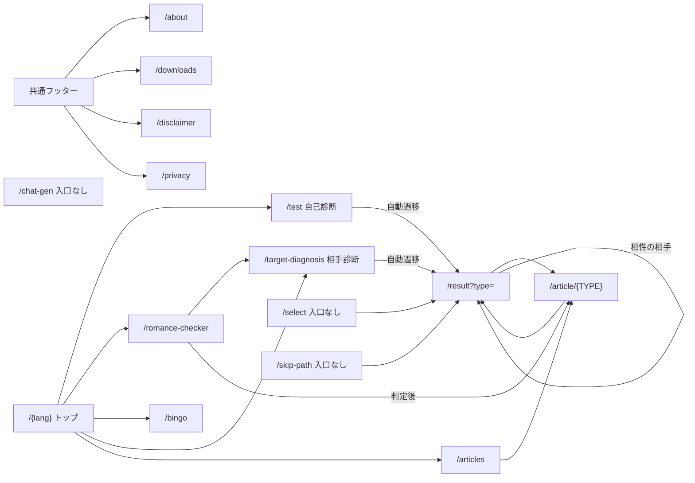

# CognitiveLens 現状サイト仕様（2026-09-15 時点）

## この文書について

コグニティブレンズ（https://www.cognitive-lens.com）の現状を、改修の前提資料としてまとめた。対象は `D:\mbti_project`（GitHub `hayabusarain/cognitive-lens`）の作業ツリー。HEAD は `47470c9`（2026-05-23）で、その上に未コミットの「動画生成機能の削除」（84ファイル削除・6ファイル修正）が乗った状態を調べている。

調べ方は2通り。コードを読んだうえで、本番ビルドをローカルで起動し、69 URL の HTML を取得して title・description・見出し・リンクを機械的に抜き出した。文章トーンの数値はスクリプトで計測している。

根拠の強さは次の3段階で書き分ける。

| 表記 | 意味 |
|---|---|
| 確認済み | 実際にビルド・取得・描画して確かめた |
| コード上 | コードとデータから読み取った。実行はしていない |
| 未確認 | 手元の情報では判断できない |

**公開中サイトとの差分**：動画生成用の管理画面4ページ（`/ja/video-gen` など）と API 6本は、push していないため公開サイトでは今も開ける（確認済み）。robots.txt、sitemap、`/en` の `html lang` と title は公開サイトでもこの文書と同じだった（確認済み）。

改修時に先に読むべき不具合は「7. 調査中に見つかった問題」にまとめた。

---

## 1. 全ページの URL / title / description / h1

### 1-1. 共通の既定値

metadata を持たないページは、`app/layout.tsx` の値がそのまま使われる。英語ページでも日本語のまま出る。

- **既定 title**：`CognitiveLens (コグニティブレンズ) | 16タイプ別 恋愛・対人課題解決プラットフォーム`
- **既定 description**：`CognitiveLens (コグニティブレンズ) は、16の性格タイプや認知機能モデルを用いて、恋愛やコミュニケーションのすれ違いを最適化・解剖する次世代の診断プラットフォームです。`

下表の「既定」はこの2つを指す。h1 はサーバーが返す初期 HTML に含まれるもので、JavaScript 実行後に変わる画面は含まない（確認済み）。

### 1-2. ページ一覧

| URL | 言語 | title | description | h1（初期 HTML） |
|---|---|---|---|---|
| `/` | — | — | — | 307 で `/ja` へ転送 |
| `/ja` | ja | 既定 | 既定 | 「なぜか上手くいかない」対人関係のすれ違い、その正体を見つける。 |
| `/en` | en | 既定（日本語） | 既定（日本語） | Exposing your toxic traits & unhinged red flags. |
| `/ja/test` | ja | 既定 | 既定 | **なし**（設問文は h2） |
| `/en/test` | en | 既定（日本語） | 既定（日本語） | **なし** |
| `/ja/result?type={TYPE}` | ja | `{TYPE} {型名} — 深層心理プロファイリング \| CognitiveLens` | 型のタグライン（例：全てを一人で完結させる最強の裏アカ） | **なし**（初期表示は解析中画面） |
| `/en/result?type={TYPE}` | en | `{TYPE} {Name} — Deep Psychological Profiling \| CognitiveLens` | 英語タグライン（例：Strategic Mastermind） | **なし** |
| `/ja/select` | ja | 既定 | 既定 | プロファイルを直接選択 |
| `/en/select` | en | 既定（日本語） | 既定（日本語） | Select Profile Directly |
| `/ja/target-diagnosis` | ja | 既定 | 既定 | **なし**（設問文は h2） |
| `/en/target-diagnosis` | en | 既定（日本語） | 既定（日本語） | **なし** |
| `/ja/skip-path` | ja | 既定 | 既定 | 自分のタイプを知っている人へ。 |
| `/en/skip-path` | en | 既定（日本語） | 既定（日本語） | For those who already know their type. |
| `/ja/romance-checker` | ja | 脈あり・恋愛逆引きチェッカー \| CognitiveLens | 気になる相手の行動から、MBTIタイプと脈あり度を逆算・判定します。 | ターゲットのMBTIを選んでください |
| `/en/romance-checker` | en | Pulse & Romance Reverse Checker \| CognitiveLens | Reverse-calculate MBTI type and pulse level from the behavior of your crush. | Select the Target's MBTI |
| `/ja/bingo` | ja | 偏見だらけのMBTIビンゴ \| CognitiveLens | あなたのMBTIの「あるある」をビンゴでチェック！SNSにシェアして盛り上がろう。 | 偏見だらけの MBTIビンゴ |
| `/en/bingo` | en | 日本語版と同じ | 日本語版と同じ | Biased MBTI Bingo |
| `/ja/articles` | ja | 16タイプ別 恋愛・コミュニケーションコラム一覧 \| CognitiveLens | 16タイプの恋愛傾向やコミュニケーションのクセを深掘りしたコラム記事一覧です。 | 恋愛・コミュニケーションコラム |
| `/en/articles` | en | 16 Personality Types Romance & Communication Columns \| CognitiveLens | Deep dive into the romantic tendencies and communication habits of all 16 MBTI personality types. | Romance & Communication Columns |
| `/{lang}/article/{TYPE}` | ja/en | `{記事タイトル} \| CognitiveLens 恋愛心理コラム` | 記事本文「基本の恋愛心理」の先頭120字 + `...` | 記事タイトル（1-3 参照） |
| `/ja/about` | ja | 運営者情報 \| CognitiveLens | CognitiveLensの運営者について | 運営者情報 |
| `/en/about` | en | 日本語版と同じ | 日本語版と同じ | About Us |
| `/ja/disclaimer` | ja | 免責事項 \| CognitiveLens | CognitiveLensの免責事項について | 免責事項 |
| `/en/disclaimer` | en | 日本語版と同じ | 日本語版と同じ | Disclaimer |
| `/ja/privacy` | ja | Privacy Policy & Disclaimer \| CognitiveLens | CognitiveLens Privacy Policy, Cookie Usage, and Disclaimer | プライバシーポリシー・免責事項 |
| `/en/privacy` | en | 日本語版と同じ（英語） | 日本語版と同じ（英語） | Privacy Policy & Disclaimer |
| `/ja/downloads` | ja | キャラクター素材ダウンロード \| CognitiveLens | 全16タイプのキャラクター画像をフリー素材として配布しています。 | キャラクター画像フリー配布所 |
| `/en/downloads` | en | Character Assets Download \| CognitiveLens | Distributing free character assets for all 16 personality types. | Free Character AssetsDistribution（改行が ` ` のため単語が連結） |
| `/ja/chat-gen` | ja | 既定 | 既定 | 認知機能の断絶を、可視化する。 |
| `/en/chat-gen` | en | 既定（日本語） | 既定（日本語） | 日本語版と同じ（英語版なし） |
| 存在しないパス（例 `/ja/article/XXXX`） | — | 404: This page could not be found. | 既定 | 404（`noindex` 付き） |

`/result` で `type` を省略すると INTP として表示される。title にも INTP が入り、検索結果に重複ページとして出る余地がある（確認済み）。

### 1-3. 記事ページ（32本）

`generateStaticParams` で日英16本ずつ静的生成される。32本すべてで title から接尾辞を除いた文字列と h1 が一致した（確認済み）。日本語版の description は94〜123字、英語版はすべて123字で切れている。

| TYPE | 日本語タイトル（h1） | 英語タイトル（h1） |
|---|---|---|
| INTJ | INTJ（建築家）の恋愛：歩くロジックマシーンが『沼る』瞬間と攻略法 | INTJ: The Mastermind's Toxic Romance - Why the Rational Perfectionist Falls Hard |
| INTP | INTP（論理学者）の恋愛：検索履歴がマニアックな人が本気で恋に落ちたら | INTP: The Logician's Love Bug - Decoding the Brainiac's Romance |
| ENTJ | ENTJ（指揮官）の恋愛：圧倒的リーダーシップの愛し方 | ENTJ: The Commander's Power Couple Vision - Romance as a Strategy |
| ENTP | ENTP（討論者）の恋愛：自由すぎる刺激的な恋愛ゲーム | ENTP: The Debater's Chaotic Love - Dating the Ultimate Trickster |
| INFJ | INFJ（提唱者）の恋愛：心を読まれる？ミステリアスな愛 | INFJ: The Advocate's Deep Dive - Searching for a Soulmate |
| INFP | INFP（仲介者）の恋愛：理想の世界で生きる繊細なロマンチスト | INFP: The Mediator's Hopeless Romance - Living in a Fantasy |
| ENFJ | ENFJ（主人公）の恋愛：尽くしすぎる愛の供給マシーン | ENFJ: The Protagonist's Passion - The Ultimate Caretaker |
| ENFP | ENFP（広報運動家）の恋愛：自由と刺激を求める愛嬌たっぷりのハリケーン | ENFP: The Campaigner's Wild Ride - A Hurricane of Affection |
| ISTJ | ISTJ（管理者）の恋愛：超堅実で絶対に裏切らない歩く安全保障 | ISTJ: The Logistician's Fortress - The Safest Bet in Love |
| ISFJ | ISFJ（擁護者）の恋愛：献身と気遣い。海より深い愛情 | ISFJ: The Defender's Devotion - Unconditional Caretaking |
| ESTJ | ESTJ（幹部）の恋愛：効率と結果で愛を示す頼りになる存在 | ESTJ: The Executive's Efficiency - The Ultimate Boss Partner |
| ESFJ | ESFJ（領事）の恋愛：愛で満たしたい世話焼きタイプ | ESFJ: The Consul's Warmth - The Ultimate Socialite Romance |
| ISTP | ISTP（巨匠）の恋愛：言葉より行動で語る一匹狼の恋 | ISTP: The Virtuoso's Silence - The Lone Wolf's Love |
| ISFP | ISFP（冒険家）の恋愛：今この瞬間の「感覚」を共有する平和な恋 | ISFP: The Adventurer's Aesthetic - A Sensual, Free-Spirited Romance |
| ESTP | ESTP（起業家）の恋愛：スリルと刺激を愛するアクションの恋 | ESTP: The Entrepreneur's Thrill - Fast, Furious, and Flirty |
| ESFP | ESFP（エンターテイナー）の恋愛：人生謳歌！愛と光のエンターテイナー | ESFP: The Entertainer's Spotlight - A Flamboyant, High-Energy Love |

### 1-4. API

画面ではないが、ページの挙動と費用に関わるので併記する。

| エンドポイント | 呼び出し元 | 処理 | 外部サービス | 保護 |
|---|---|---|---|---|
| `POST /api/result` | `/skip-path` | タイプと「失敗パターン」から4段の分析文をストリーミング生成 | OpenAI gpt-4o-mini | Bot 判定、IP ごとに10分3回、1時間キャッシュ |
| `POST /api/romance-ai` | `/romance-checker` | YES と答えた行動から本音・次の一手・地雷を JSON で生成 | OpenAI gpt-4o-mini | Bot 判定、IP ごとに10分5回 |
| `POST /api/chat-script` | `/chat-gen` | 2タイプの恋人同士の LINE 風会話を8〜10往復生成 | OpenAI gpt-4o-mini | Bot 判定のみ |
| `GET /api/chat-og` | `/chat-gen` | 会話 JSON をクエリで受け取り 1080×1920 の画像にする | なし | — |
| `GET /api/og` | `/result` の OGP | 1200×630 の OG 画像 | なし | — |
| `GET /api/story-card` | `/result` | 1080×1920 のインスタ用カード画像 | なし | — |
| `POST /api/weakness` | **なし** | 5項目の弱点スコアを生成 | OpenAI gpt-4o-mini | Bot 判定のみ |
| `GET /api/admin/seed-protocols` | **なし** | Supabase の `protocols` テーブルを全削除して入れ直す | Supabase | **認証なし** |

`proxy.ts` が `/api/*` すべてに「IP ごとに1分10回」と Bot 判定をかけている（コード上）。Bot 判定は OG 画像にも効いていて、SNS のクローラーを弾いている（6-4 参照）。

---

## 2. 各ページの役割と内部リンク構造

### 2-1. ページの役割

| ページ | 役割 | 入口（内部リンク元） | 出口 |
|---|---|---|---|
| `/{lang}` トップ | 5機能への入口と、サイト説明文 | 全ページのロゴ・戻るリンク | test、romance-checker、bingo、target-diagnosis、articles |
| `/test` | 自分の16タイプを判定する20問の診断 | トップ、skip-path、select、結果ページ | 回答後に自動で `/result?type=&a=` へ |
| `/result` | タイプ別の結果。静的データの寄せ集め（3-2 参照） | test、target-diagnosis、select、skip-path、記事、相性欄 | 記事16本、相性の相手の結果、X 共有、画像保存 |
| `/target-diagnosis` | 気になる相手のタイプを推定する20問 | トップ、romance-checker | 回答後に自動で `/result?type=` へ |
| `/romance-checker` | 相手のタイプ別の YES/NO 設問から「脈あり度」を出す | トップ | target-diagnosis、判定後に該当タイプの記事 |
| `/bingo` | 自分のタイプの「あるある」ビンゴ。画像保存と X 共有 | トップ | X 共有のみ |
| `/articles` | 恋愛コラム16本の一覧 | トップ | 記事16本 |
| `/article/{TYPE}` | タイプ別の恋愛コラム | articles、結果ページ、romance-checker の判定後 | 同タイプの結果ページ |
| `/select` | 診断を飛ばしてタイプを直接選ぶ | **なし** | 結果ページ、test |
| `/skip-path` | タイプと失敗パターンから AI 分析文を生成 | **なし** | 結果ページ、test |
| `/chat-gen` | 2タイプの口論チャット画像を AI 生成 | **なし** | `/`（トップ） |
| `/about` | 運営者情報 | フッター | X、メール |
| `/downloads` | キャラクター画像16枚の配布 | フッター | 画像ファイル |
| `/disclaimer` | 免責事項 | フッター | — |
| `/privacy` | プライバシーポリシー | フッター、Cookie バナー（リンク切れ） | Google・OpenAI の規約 |

`/select`・`/skip-path`・`/chat-gen` はどこからもリンクされておらず、sitemap にも載っていない（確認済み）。辞書 `dictionaries/ja.json` に使われていない `about_link`「タイプを知っている方はこちら」が残っていて、以前は `/select` への導線があったとみられる。

### 2-2. リンク構造図

### 2-3. 共通要素

フッター（`app/components/layout/Footer.tsx`）は全ページに出る。リンク先は運営者情報・キャラ素材・免責事項・プライバシーポリシーと、「お問い合わせ」と書かれた X アカウント（`https://x.com/CognitiveLens_`）。言語は URL が `/en` で始まるかどうかで切り替わる。

言語切替（`LanguageSwitcher`）はトップにしかない。トップ以外の画面から英語に切り替える手段はない（コード上）。

### 2-4. 壊れている・意図どおりでない導線

- **結果ページの「やり直す」**：`/test` へ遷移する。言語の付かない `/test` は `[lang]` に `test` が入ったトップとして 200 で表示され、中のリンクは `/test/test` などすべて壊れる（確認済み）。
- **結果ページの「ホーム」**・**chat-gen の「ホーム」**：`/` へ遷移し、英語で見ていても `/ja` に戻る（コード上）。
- **Cookie バナーの「プライバシーポリシー」**：`/privacy` へのリンクで、上と同じく壊れたトップが出る（確認済み）。
- **未知のパス全般**：先頭の区切りが言語として扱われ、`/translate` や `/ko` もトップとして 200 を返す（確認済み）。`/ko` だけは韓国語の見出しが出るが、他の画面は日本語になる。

---

## 3. 診断ロジック仕様

### 3-1. 自己診断 `/test`

設問は20問（`lib/questions.ts`、英語版は `lib/questions-en.ts`）。E/I → S/N → T/F → J/P の順に5問ずつ並び、順番は固定で入れ替わらない。1問につき選択肢は2つで、それぞれ E か I のように片方の文字に対応する。

| 項目 | 仕様 |
|---|---|
| 問数 | 20問（4軸×5問） |
| 選択肢 | 2択。各選択肢に絵文字つき |
| 画面に出る情報 | 設問の上に軸名（例「E / I」）、各選択肢の右端に対応する文字（例「E」）を表示 |
| 戻る | 可能（直前の回答を取り消す） |
| 集計 | 軸ごとに文字の出現数を数え、多い方を採用 |
| 同数のとき | E・S・T・J を採用（`>=` 判定）。ただし各軸5問なので同数は起こらない |
| 遷移先 | `/{lang}/result?type={4文字}&a={20文字の回答列}` |

画面上で各選択肢がどの文字に対応するかが見えるので、狙った結果に誘導できる（コード上）。進捗バーは CSS クラスが定義されておらず表示されない（4-3 参照）。

### 3-2. 結果ページ `/result`

結果は **URL の `type` だけで決まる静的な表示**。`a`（回答列）は受け取っているが使っていない。回答内容によって文章が変わることはない（コード上）。

表示の流れは次のとおり。

1. 3秒間、固定の「解析中」画面を出す（タイマーによる演出で、計算はしていない）
2. タイプカード：キャラクター画像、4文字コード、型名、タグライン
3. X 共有ボタン：本文に相性の最強・最悪の相手を入れて投稿画面を開く
4. インスタ用カード：`/api/story-card?type=` の画像を表示・保存
5. 本性プロファイル：`lib/static-profiles.ts` の3節（見出しは全タイプ共通「あなたのデフォ設定（裏アカ仕様）」「恋愛のときの検索アルゴリズム」「ガチでヤバい神機能」）
6. 行動プロトコル：`lib/protocols-ja.ts` の「短期」「長期」「教育」を各3件、アコーディオンで表示
7. NG 行動（地雷）：データが空のため**表示されない**
8. 対人相性：`lib/compatibility.ts` の最強の相手・最悪の相手とその理由
9. 適職：`lib/career-data.ts`。**日本語のみ**
10. 恋愛コラムへの16タイプ一覧

英語版では 8 の「最悪の相手」の説明文が空になる。日本語データのキーが `advice`、英語データのキーが `reason` で、画面は `advice` を読むためだ（コード上）。

### 3-3. 相手診断 `/target-diagnosis`

「あの人」についての20問（`lib/target-questions.ts`）。構造は自己診断と同じで、4軸×5問、2択、順番固定。

| 項目 | 仕様 |
|---|---|
| 集計 | 8文字それぞれに加点し、軸ごとに多い方を採用 |
| 同数のとき | I・N・F・P を採用（`>` 判定）。各軸5問なので起こらない |
| 戻る | 不可 |
| 演出 | 最終回答後2秒の「解析中」 |
| 遷移先 | `/{lang}/result?type=`。自己診断と**同じ結果ページ**に出る |

結果ページは「あなたの取り扱い説明書」という見出しで二人称の文章なので、相手の診断結果を読むと主語が噛み合わない。

### 3-4. 脈あり度 `/romance-checker`

1. 相手のタイプを16個から選ぶ
2. そのタイプ専用の行動設問に YES / NO で答える（`lib/romance-data-ja.ts`）
3. 最低3秒の演出を挟んで判定を出す

| 項目 | 仕様 |
|---|---|
| 設問数 | 日本語は各タイプ20問、**英語は各タイプ10問**。英語画面の説明文は「20 questions」のまま |
| 脈あり度 | YES の数 ÷ 設問数 × 100（四捨五入） |
| 本音・次の一手・地雷 | YES の設問文を `/api/romance-ai` に送り、AI が生成 |
| YES が0件 | API を呼ばず、固定文「明確な好意のサインは見受けられません」などを表示 |
| API 失敗時 | 本音と地雷は固定文、次の一手はデータ内の `advice` を表示 |

metadata の description は「行動から MBTI タイプと脈あり度を逆算」とうたっているが、このページはタイプを推定しない。タイプ推定は相手診断へのリンクで補っている。

### 3-5. ビンゴ `/bingo`

| 項目 | 仕様 |
|---|---|
| マス | 5×5。中央は FREE（常に押された状態） |
| 項目 | タイプごとに24個（`lib/bingo-data-ja.ts`）。並びは固定 |
| ライン | 縦5・横5・斜め2の計12本 |
| 称号 | 0本「MBTI詐称疑惑」／1本「見習いレベル」／2〜3本「量産型」／4〜5本「ガチ勢」／6〜8本「純度100%」／9〜11本「限界突破」／12本「神の領域」 |
| 共有 | カードを PNG 保存（`html-to-image`）、X の投稿画面を開く |

X 共有に入る URL は `https://cognitivelens.com/{lang}/bingo` で、サイトのドメイン（cognitive-lens.com）とハイフンの有無が違う（7 参照）。

### 3-6. AI 生成の機能

| 機能 | 入力 | 出力 | モデル設定 |
|---|---|---|---|
| `/skip-path` | タイプ、失敗パターン（5〜400字） | 【ズバ抜けた才能と、無意識のトゲ】【絶対に認めたくない弱点】【人生をもっとラクにする攻略法】【本当は誰よりも…】の4節、800〜1000字 | gpt-4o-mini、temperature 0.88、最大1200トークン、ストリーミング |
| `/romance-checker` | 相手タイプ、YES の設問文 | 本音100〜150字、次の一手100〜150字、地雷80〜120字 | gpt-4o-mini、temperature 0.8、JSON |
| `/chat-gen` | 2タイプ | 恋人同士の LINE 風会話8〜10往復、1通45字以内、ハッピーエンド禁止 | gpt-4o-mini、temperature 0.95、JSON |

プロンプトはいずれも読者を16〜24歳と指定し、「刺して、救う」「エモい毒舌」「蛙化現象」「既読スルー」などの語でトーンを指示している。`/chat-gen` は日本語のプロンプトしかない。

### 3-7. 認知機能スコア

`lib/cognitive-functions.ts` にタイプ別の8機能スコアが固定値で入っている。回答からは計算しない。

| 位置 | 主機能 | 補助機能 | 第三機能 | 劣等機能 | 影の4機能 |
|---|---|---|---|---|---|
| スコア | 95 | 78 | 52 | 28 | 35・22・15・10 |

画面には表示されていない。使い道は `/api/result` のプロンプトに主機能と劣等機能を埋め込むことだけだ。以前あったレーダーチャートは 2026-05-06 のコミット `80471d8` で削除されている。

### 3-8. 静的データの一覧

| データ | ファイル | 件数 | 1タイプあたり | 日英の差 |
|---|---|---|---|---|
| 型名・タグライン・説明 | `lib/type-info.ts` / `-en` | 16 | 名前・タグライン・説明・絵文字・画像・配色 | 型名の系統が違う（5 参照） |
| 本性プロファイル | `lib/static-profiles.ts` | 16 | 3節、日本語で平均499字 | — |
| 行動プロトコル | `lib/protocols-ja.ts` / `-en` | 16 | 短期・長期・教育を各3件 | 英語は短く穏やか |
| 恋愛コラム | `lib/article-data.ts` / `-en` | 16 | 4節で日本語平均443字、脈ありサイン | 脈ありサインは**日本語4件・英語5件**。見出しは両方「5選」 |
| 相性 | `lib/compatibility.ts` / `-en` | 16 | 最強・最悪の相手と理由 | 最悪の相手の理由のキー名が違う（3-2） |
| 適職 | `lib/career-data.ts` | 16 | 地獄の職業・生存ルート・面接のコツ | 英語版なし |
| 脈ありチェッカー | `lib/romance-data-ja.ts` / `-en` | 16 | 設問とアドバイス | 設問 日本語20・英語10 |
| ビンゴ | `lib/bingo-data-ja.ts` / `-en` | 16 | 24項目 | — |
| 診断設問 | `lib/questions.ts` / `-en` | 20問 | — | — |
| 相手診断設問 | `lib/target-questions.ts` / `-en` | 20問 | — | — |

相性の組み合わせ（日本語データ）は次のとおり。最強の相手は全ペアで双方向に一致している。

INTJ◎ENFP×ESFJ、INTP◎ENTJ×ESFJ、ENTJ◎INTP×ISFP、ENTP◎INFJ×ISFJ、INFJ◎ENTP×ESTJ、INFP◎ENFJ×ESTJ、ENFJ◎INFP×ISTP、ENFP◎INTJ×ISTJ、ISTJ◎ESFP×ENFP、ISFJ◎ESTP×ENTP、ESTJ◎ISFP×INFJ、ESFJ◎ISTP×INTJ、ISTP◎ESFJ×ENFJ、ISFP◎ESTJ×ENTJ、ESTP◎ISFJ×INFJ、ESFP◎ISTJ×INTJ

---

## 4. UI コンポーネント一覧と、現状の文章トーン

### 4-1. 共通コンポーネント（`app/components/`）

| コンポーネント | 使用箇所 | 役割と現状 |
|---|---|---|
| `layout/Footer` | 全ページ（`app/layout.tsx`） | 固定リンク5つと「© 2025 CognitiveLens」 |
| `CookieConsentBanner` | 全ページ | 初回のみ下部に表示。「利用を継続することで同意したものとみなす」方式で、拒否ボタンはない。日本語のみ。同意は localStorage の `cookie_consent_v1` に保存 |
| `LanguageSwitcher` | トップのみ | 日本語 / 「English (Gen-Z)」の切替。日本語表示中は「For English 👉」が点滅 |
| `AnalyzingLoader` | chat-gen | 最低8秒の進捗演出 |
| `result/NextActionCTA` | **なし** | 未使用 |

### 4-2. ページ内の部品

結果ページ（`app/[lang]/result/ResultContent.tsx`）に部品がまとまっている。`AnalyzingScreen`（3秒演出）、`ShareButton`（X 共有）、`StoryShareCard`（インスタ用画像）、`AiProfileSection`（本性プロファイル。名前に AI とあるが中身は静的データ）、`AccordionSection`（行動プロトコル）、`NgWordsSection`（データが空で非表示）、`CompatibilitySection`（相性）、`CareerSection`（適職、日本語のみ）の8つ。

その他のページ固有の部品は、skip-path の `SectionCard`（AI 出力の節表示）と chat-gen の `TypeSelect`（タイプ選択）。ビンゴと脈ありチェッカーは、1ファイルの中で画面の段階ごとに描き分けている。

### 4-3. デザインの基盤

スタイルは Tailwind CSS v4 と `app/globals.css` の独自クラスで組まれている。アイコンは `lucide-react`、アニメーションは `framer-motion`（脈ありチェッカーとビンゴのみ）。

| クラス | 用途 | 定義 |
|---|---|---|
| `glass-card` | すりガラス風のカード。19箇所で使用 | あり |
| `aurora-bg` / `aurora-mid` | 水色〜紫のぼかし背景 | あり |
| `nav-blur` | 上部ナビの半透明背景 | あり |
| `bubble`、`btn-primary`、`btn-ghost`、`input-dark`、`badge-dark` | 吹き出し、ボタン、入力欄、バッジ | あり |
| `badge-neon` | ネオン風バッジ | あり（未使用） |
| `progress-track` / `progress-fill` | `/test` の進捗バー | **なし**。バーが描画されない |
| `animate-float` / `animate-fade-in-up` | トップのキャラ浮遊、ヒント文のフェード | **なし**。動かない |
| `animate-in`、`slide-in-from-right-8`、`zoom-in` | 相手診断の設問切替 | **なし**。`tailwindcss-animate` が入っていないため効かない |

配色トークンは `--color-cyan: #00e5ff` を主アクセントに、紫 `#7c3aed` とマゼンタ `#e040fb` を併用する。見出しは全体に `font-weight: 800` と字間 -0.04em が当たっている。

画面ごとに明暗が混在している。トップ・自己診断・結果・記事・規約系は明るいオーロラ背景で、相手診断・ビンゴ・脈ありチェッカーの判定画面は `bg-slate-950` の暗い背景になる。脈ありチェッカーは選択画面が明るく、判定画面で暗くなる。

### 4-4. 文章トーン（計測値）

日本語の文字列をファイルから抜き出し、文末で分類した。文は句点・感嘆符・改行で区切り、6字未満は除いた。「その他」は分類規則に当てはまらなかった文で、疑問文や引用で終わる文が多い。

| 対象 | 文数 | 平均字数 | 45字超 | 主な文末 | 目立つ語尾・語彙 |
|---|---|---|---|---|---|
| 画面の説明文（`app/` 内） | 412 | 28 | 17% | 敬体38%、体言止め36% | 「〜ありません」「〜しましょう」「〜てください」 |
| 型紹介（type-info） | 72 | 28 | 17% | 体言止め75% | 「最強」7、「絶対」5、「マジ」4、「エモ」4 |
| 本性プロファイル | 281 | 31 | 17% | 体言止め41%、常体20%、口語15% | 「〜なんだよね」系、「ガチ」19、「ヤバ」16、「絶対」15 |
| 行動プロトコル | 373 | 27 | 6% | **命令・禁止42%** | 「〜のやめろ」「身につけろ」「逃げるな」「寝ろ」 |
| 恋愛コラム | 312 | 31 | 13% | 常体43%、体言止め31% | 「絶対」18 |
| 相性 | 89 | 37 | 30% | 常体53% | 感嘆符17 |
| 適職 | 130 | 25 | 3% | 体言止め34%、常体28%、命令17% | 「〜を選べ」「〜につけ」 |
| 脈ありチェッカー設問 | 380 | 23 | 2% | 常体82% | 「〜してくれる」系が104件 |
| ビンゴ | 343 | 9 | 0% | 常体37%、体言止め29% | 「〜ないと死ぬ」「知らんけど」 |

日本語版は一つのサイトの中に3つの声が同居している。画面の説明文は「です・ます」の丁寧な解説調で、サイト説明ブロックが特に硬い。型紹介と本性プロファイルは友達が話すような常体で、スマホ・SNS の比喩（裏アカ、通知、アプデ、ブラウザ）が軸になっている。行動プロトコルと適職は命令形の毒舌で、例は「LINEの文面を深読みしすぎるな。（中略）とりあえず寝ろ。」。

語句の重なりも多い。本性プロファイルの見出し3つは全16タイプで同じ文言だ。脈ありチェッカーの設問は「〜してくれる」が全380文の27%を占める。二人称は「あなた」に統一する置換コミット（`0594005`）があったが、「お前」が恋愛コラムと相性データに1件ずつ残っている。

英語版は Z 世代のスラングで書かれている（`vibe` 13件、`literally` 12件、`toxic` 5件、`unhinged` 4件、`rizz` 2件など）。トップの見出しは「Exposing your toxic traits & unhinged red flags.」で、日本語版の「すれ違いの正体を見つける」より攻撃的だ。一方で行動プロトコルは英語の方が短く穏やかで、日本語版 INFP の「とりあえず寝ろ」に当たる箇所が「Stop daydreaming; put those beautiful thoughts into action.」になっている。言語によって毒の強さが逆転している箇所がある。

---

## 5. 外部素材の出典

### 5-1. キャラクター画像

`public/characters/{TYPE}.png` の16枚。すべて 800×1000 の PNG で、トップ、結果、記事、ビンゴ、ダウンロード、インスタ用カードで使っている。

| 項目 | 状況 |
|---|---|
| 追加された時期 | 2026-04-19 のコミット `5880e2b`（「complete rewrite UI/UX and logic, add downloaded page」）で一括追加。以後の変更なし |
| 埋め込みメタデータ | 16枚とも作者・生成ツール・プロンプトの記録なし。C2PA（生成 AI の来歴情報）もなし（確認済み） |
| 作者・生成手段 | **未確認**。リポジトリ内に記録がない |
| サイト上の表記 | `/downloads` で「オリジナルキャラクター」として配布。商用利用禁止、クレジット必須、二次配布・トレス・AI 学習への利用を禁止 |

配布規約を掲げている以上、画像の権利が運営者にあることが前提になる。作者か生成手段を記録しておく必要がある。

### 5-2. フォント

サイト本体は外部フォントを読み込んでいない。`next/font` も Google Fonts の読み込みもなく、端末のシステムフォントで表示される（コード上）。README に Geist フォントの記述があるが、create-next-app の雛形のままで実際には使っていない。

OG 画像とインスタ用カード（`next/og`）は `fontFamily: "sans-serif"` 指定のみ。ローカルで生成した画像では、日本語も絵文字も文字化けせず描画された（確認済み）。`next/og` は足りない字形を実行時に外部から取得する仕様とされるが、取得先とそのライセンスは今回の調査で実測していない（未確認）。

### 5-3. 型名と説明文

| 項目 | 内容 | 出典の表記 |
|---|---|---|
| 日本語の型名 | スマホ・SNS の比喩による独自名（例：INTJ「通知全オフのガチ勢スマホ」、INTP「検索履歴ヤバい系ブラウザ」） | なし。自作とみられる |
| 英語の型名 | Architect、Logician、Commander、Debater、Advocate、Mediator、Protagonist、Campaigner、Logistician、Defender、Executive、Consul、Virtuoso、Adventurer、Entrepreneur、Entertainer | **なし** |
| 日本語記事の呼称 | 建築家、論理学者、指揮官、討論者、提唱者、仲介者、主人公、広報運動家、管理者、擁護者、幹部、領事、巨匠、冒険家、起業家、エンターテイナー | **なし** |
| 4文字コードと「MBTI」 | ビンゴと脈ありチェッカーの title・h1、設問文、共有文に「MBTI」を使用 | トップ・ビンゴ・脈ありチェッカーの下部に「マイヤーズ・ブリッグス財団や公式の MBTI® テストとは無関係」と注記 |
| 認知機能の順位とスコア | 主・補助・第三・劣等・影の並びと 95/78/52/28/35/22/15/10 の数値 | なし。数値の根拠は記載がない |
| 本文テキスト | 型紹介、プロファイル、プロトコル、コラムなど | なし |

英語の型名16個と日本語記事の呼称16個は、性格診断サイト 16Personalities（NERIS Analytics Limited）が使う名称と一致する（名称の一致は確認済み）。使用条件や権利上の扱いは未確認。

「MBTI」の語は、商標対応として一部を削除・修正したコミット（2026-05-06 の `3656ac5`、05-16 の `a18d311`）があるものの、上表の箇所に残っている。

本文テキストの成り立ちも記録が薄い。2026-04-30 に「OpenAI で全アドバイス文を書き換え」るコミット（`1db7693`）があり、その4分後に「元の文体に戻す」 revert（`17eaaaf`）が入っている。現在の文章のうちどれが AI の生成・加筆によるものかは、履歴から特定できない（未確認）。

### 5-4. 外部サービスと外部リンク

| 種別 | 相手先 | 用途 |
|---|---|---|
| 解析 | Vercel Web Analytics（`@vercel/analytics`） | アクセス解析 |
| 生成 AI | OpenAI API（gpt-4o-mini） | 3-6 の AI 機能 |
| データベース | Supabase | 認証なしの投入 API からのみ使用。画面からは読んでいない |
| SNS | X（`twitter.com/intent/tweet`） | 結果とビンゴの共有 |
| リンク | `x.com/CognitiveLens_`、`openai.com/policies/privacy-policy` | 運営者情報、規約 |
| 連絡先 | `contact@cognitivelens.com` | 運営者情報のメール |

連絡先メールのドメインはサイトと違い、ハイフンがない `cognitivelens.com` になっている。このドメインは Vercel ではない別のサーバーを指し、アクセスすると `/lander` へ転送されるだけのページが出る。メールは Microsoft 365 に配送される設定だった（確認済み）。持ち主が運営者本人かどうかは未確認。

---

## 6. 計測タグ、sitemap、robots、OGP の現状

### 6-1. 計測タグ

| タグ | 設置場所 | 状況 |
|---|---|---|
| Google サイト確認 meta | `app/layout.tsx` | `google-site-verification` を設置。Search Console の登録状況は未確認 |
| Vercel Analytics | `app/layout.tsx` の `<Analytics />` | 設置済み。Vercel 側で有効かは未確認 |
| Google Analytics / GTM | — | なし |
| イベント計測 | — | なし。診断完了、共有、画像保存は計測していない |

### 6-2. sitemap（`app/sitemap.ts`）

| 項目 | 状況 |
|---|---|
| URL 数 | 54（日英 × 静的11 + 記事16） |
| ドメイン | `NEXT_PUBLIC_SITE_URL` が未設定なら `https://cognitive-lens.com`（www なし）。実サイトは www へ 307 転送 |
| 404 の URL | `/ja/translate`、`/en/translate`。翻訳機能は 2026-05-06 に削除済み（確認済み） |
| 載っていないページ | `/result`、`/select`、`/skip-path`、`/chat-gen` |
| lastmod | 生成時刻。アクセスのたびに全 URL が「今」になる |
| 優先度 | トップ 1.0（daily）、記事 0.9（weekly）、他 0.8（monthly） |
| hreflang | なし |

`app/layout.tsx` の `metadataBase` は `NEXT_PUBLIC_BASE_URL` を読み、sitemap は `NEXT_PUBLIC_SITE_URL` を読む。同じ用途に別の環境変数名が使われている。

### 6-3. robots.txt

`public/robots.txt` の静的ファイル。全クローラーに全体を許可し、`GPTBot` と `ChatGPT-User` だけを禁止している。Sitemap 行は www なしのドメインを指す。公開サイトで 200 を返す（確認済み）。

### 6-4. OGP・canonical・言語指定

| 項目 | 状況（確認済み） |
|---|---|
| OGP（`og:*`） | **結果ページのみ**。他の全ページに `og:title`・`og:image` がない |
| Twitter カード | 結果ページのみ `summary_large_image` |
| OG 画像 | `/api/og?type=&lang=`（1200×630）。URL は www なしドメインで出力される |
| canonical | 全ページなし |
| hreflang | 全ページなし |
| 構造化データ（JSON-LD） | 全ページなし |
| `<html lang>` | **英語ページも含め全ページ `ja`** |
| robots meta | 404 ページのみ `noindex` |

OG 画像そのものが SNS から取得できない。`proxy.ts` の Bot 判定が `/api/*` にかかっていて、User-Agent に「bot」を含むクローラーを 403 で弾いている。公開サイトで `/api/og` を試した結果は次のとおり（確認済み）。

| クローラー | 応答 |
|---|---|
| 通常のブラウザ | 200 |
| Twitterbot（X） | **403** |
| Slackbot | **403** |
| Discordbot | **403** |
| Googlebot | **403** |
| facebookexternalhit（Facebook） | 200 |

結果ページを X で共有すると、カードの画像が出ない。

### 6-5. Cookie 同意

バナーは「利用を継続すると同意とみなす」方式で、拒否や設定の選択肢はない。解析のタグは同意の有無にかかわらず最初から読み込まれる（コード上）。バナーの文面は日本語のみで、英語ページにも日本語で出る。

---

## 7. 調査中に見つかった問題

重大度は、利用者・運営への影響の大きさで並べた。

| # | 問題 | 場所 | 影響 | 根拠 |
|---|---|---|---|---|
| 1 | 認証なしの GET で Supabase の `protocols` テーブルを全削除・再投入できる | `app/api/admin/seed-protocols/route.ts` | 誰でも DB を書き換えられる。画面はこのテーブルを読まないので表示は壊れない | コード上 |
| 2 | OG 画像が X・Slack・Discord・Google のクローラーに 403 を返す | `proxy.ts` の Bot 判定 | 結果ページの共有カードに画像が出ない | 確認済み |
| 3 | 結果ページの初期 HTML に本文も h1 もない（3秒の解析中画面だけ） | `ResultContent.tsx` | 検索エンジンから結果の内容が見えない | 確認済み |
| 4 | 英語版の結果で「最悪の相手」の説明が空になる | `compatibility-en.ts` のキー名 | 英語ユーザーに欠けた画面が出る | コード上 |
| 5 | 「やり直す」と Cookie バナーのリンクが、壊れたトップに飛ぶ | `ResultContent.tsx`、`CookieConsentBanner.tsx` | 再診断とプライバシーポリシーに到達できない | 確認済み |
| 6 | 未知のパスが 404 にならず、トップを 200 で返す | `app/[lang]` | 重複ページとリンク切れが無限に生まれる | 確認済み |
| 7 | 英語ページの `html lang` が `ja` で、title・description も大半が日本語 | `app/layout.tsx` ほか | 英語での検索に出にくい | 確認済み |
| 8 | ビンゴの共有 URL と連絡先メールが、ハイフンなしの別ドメイン | `BingoClient.tsx`、`about/page.tsx` | 共有リンクがパーキングページに飛ぶ。メールが第三者に届くおそれ | 確認済み（持ち主は未確認） |
| 9 | 自己診断で選択肢ごとに対応する文字（E / I など）が見える | `test/page.tsx` | 結果を狙って選べる | コード上 |
| 10 | `/test` の進捗バーとトップ・相手診断のアニメーションが動かない | CSS クラス未定義 | 進捗が見えない | コード上 |
| 11 | sitemap に 404 の `/translate` が載り、ドメインが www なし | `app/sitemap.ts` | クロールの無駄 | 確認済み |
| 12 | 英語の脈ありチェッカーは10問なのに「20 questions」と表示 | `romance-data-en.ts` | 説明と実際が食い違う | コード上 |
| 13 | 日本語記事の見出しは「脈ありサイン・ガチ5選」だが4件しかない | `article-data.ts` | 見出しと中身が食い違う | コード上 |
| 14 | インスタ用カードが英語版でも日本語で生成される | `ResultContent.tsx`（`lang` を渡していない） | 英語ユーザーに日本語画像 | コード上 |
| 15 | skip-path の英語版で、型名と入力例が日本語のまま | `skip-path/page.tsx` | 英語画面に日本語が混在 | コード上 |
| 16 | 英語の型名と日本語記事の呼称が 16Personalities と一致し、出典表記がない | `type-info-en.ts`、`article-data.ts` | 権利面の確認が必要 | 名称一致は確認済み、権利判断は未確認 |
| 17 | キャラクター画像の作者・生成手段の記録がない | `public/characters/` | 配布規約の前提が裏付けられない | 確認済み |
| 18 | プライバシーポリシーの最終更新日が 2025-01-01（リポジトリ作成は 2026-04-08）。存在しない「フィードバック機能」「テーマ設定」「チャット翻訳機能」に言及。フッターは © 2025、配布ページは © 2026 | `privacy`、`disclaimer`、`about`、`Footer` | 規約の信頼性 | コード上 |
| 19 | NG 行動の欄が常に非表示（データが空） | `ResultContent.tsx` | 見出しだけ設計されて中身がない | コード上 |
| 20 | `/select`・`/skip-path`・`/chat-gen` にどこからもリンクがない | — | 使われていないページ | 確認済み |
| 21 | 使われていないコード：`/api/weakness`、`getRelationshipTimeline`、`NextActionCTA`、`utils/supabase/client.ts`、韓国語辞書と未使用の辞書キー、`badge-neon`、`recharts` | 各所 | 保守の負担 | コード上 |
| 22 | `/api/og` のエラー処理が未定義の変数 `lang` を参照している（型エラー1件） | `app/api/og/route.tsx` 127行目 | 例外時に 500 を返す点は同じで、表示への影響はない | 確認済み（`tsc`） |
